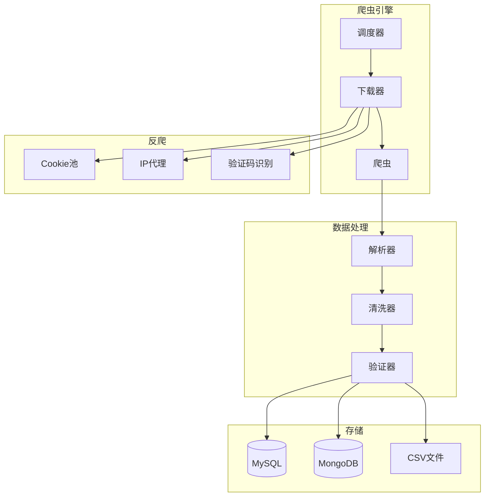

# 📕 fork-Spider_XHS - 小红书爬虫


## 📖 项目简介

fork-Spider_XHS是小红书数据爬取工具,支持爬取笔记内容、用户信息、评论数据等,用于数据分析和研究。

## 📦 项目来源

- **原项目**: 未知(待确认)
- **原作者**: 未知
- **开源协议**: 未明确标注(需查看原项目)
- **Fork时间**: 2024年

## 🔧 二次开发内容

本项目为原项目的学习研究版本,主要用于:
- 学习爬虫技术和反爬策略
- 研究数据清洗和存储方法
- 了解社交平台的数据结构

## ⚠️ 免责声明

本项目仅供学习研究使用,请勿用于商业用途或非法用途。使用本项目所产生的一切后果由使用者自行承担。

## 📖 项目简介

fork-Spider_XHS是小红书数据爬取工具,支持爬取笔记内容、用户信息、评论数据等,用于数据分析和研究。

## 🏗️ 系统架构



## ⚠️ 免责声明

**本项目仅供学习研究使用,请勿用于商业用途或非法用途。**

## 🚀 快速开始

```bash
# 克隆项目
git clone https://github.com/yourusername/fork-Spider_XHS.git

# 安装依赖
pip install -r requirements.txt

# 运行爬虫
scrapy crawl xhs
```

## 💡 核心示例

### 笔记爬取

```python
class XHSSpider(scrapy.Spider):
    name = 'xhs'
    
    def parse(self, response):
        notes = response.json()['data']['notes']
        
        for note in notes:
            yield {
                'note_id': note['id'],
                'title': note['title'],
                'content': note['desc'],
                'likes': note['likes'],
                'comments': note['comments']
            }
```

## 🎯 核心特性

- **笔记爬取**: 支持笔记内容、图片、视频
- **用户信息**: 爬取用户主页数据
- **评论数据**: 获取笔记评论信息
- **数据存储**: 多种存储方式

## 📝 更新日志

### v1.0.0 (2024-01-01)
- ✨ 初始版本发布
- ✨ 完成笔记爬取功能

---

⭐ 如果这个项目对你有帮助,欢迎Star支持!
